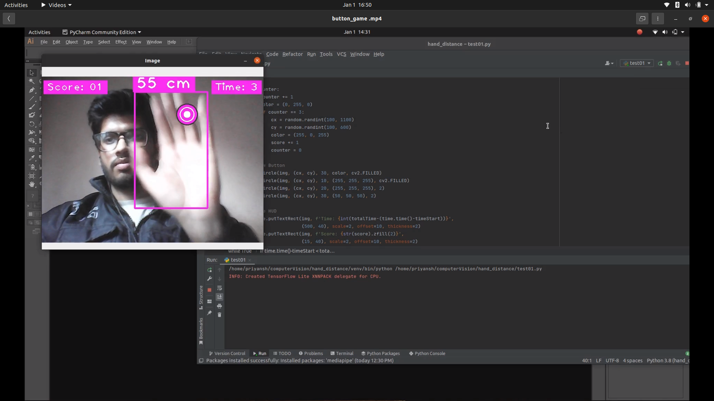
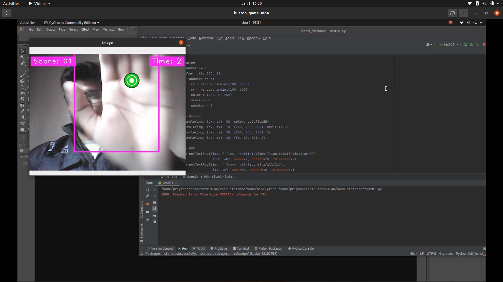
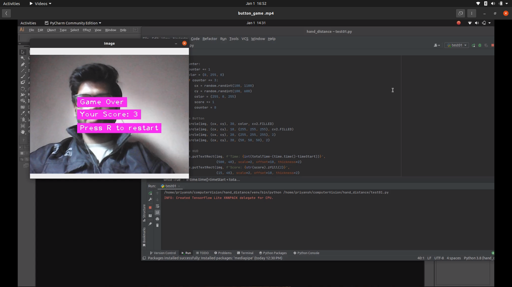

# Hand Distance Measurement Game

This is program is made to calculate the distance of your hand from the webcam.

CVZONE and MEDIAPIPELINE packages are used for detection.

Further this is used to develop a simple button pressing game that will count the score as many time as you press the button which will appear on the screeen.

I have set the time to 10 seconds, but it can be increased or decreased as per your convinence.

- Game started

- Score

- Game over

## Game Demo

https://drive.google.com/file/d/13YoSI_XuJQy5NsPOi_YIAtod2ykUfFWW/view?usp=sharing